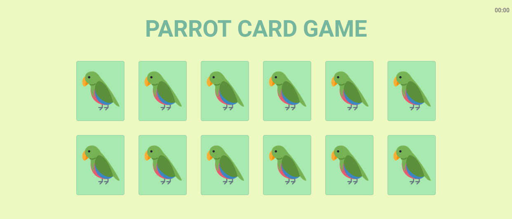

# Foodcamp

The goal of this project is to create a website that runs the game Concentration. At the start of the game, the player is asked to input the number of cards they wish to play with (4-14). All cards start laying face down. Two cards are flipped up each turn, if they have the same image they stay up. If they have different images, both cards are flipped face down. The game ends when all cards are laid face up. To achieve this, the project makes use of HTML5, CSS3, and vanilla JavaScript.

## Built With

- HTML5 , CSS3 , JavaScript
- Windows, Linux

## Live Demo

[Live Demo Link](https://vitorelourenco.github.io/parrot_card_game/)

## Authors

👤 **Vitor Emanuel Lourenco**

- GitHub: [@vitorelourenco](https://github.com/vitorelourenco)
- Twitter: [@Vitorel](https://twitter.com/Vitorel)
- LinkedIn: [vitoremanuellourenco](https://www.linkedin.com/in/vitoremanuellourenco/)

## 🤝 Contributing

Contributions, issues, and feature requests are welcome!

Feel free to check the [issues page](https://github.com/vitorelourenco/parrot_card_game/issues).

## Show your support

Give a ⭐️ if you like this project!

## Acknowledgments

- RespondeAi (https://www.respondeai.com.br/)
- The Odin Project (https://www.theodinproject.com/)

## 📝 License

This project is [MIT](lic.url) licensed.

